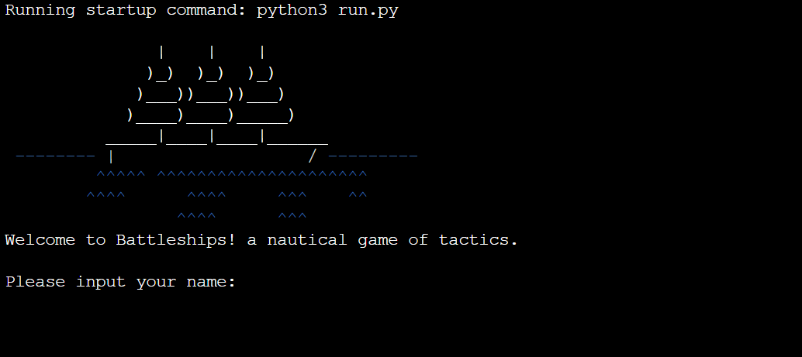
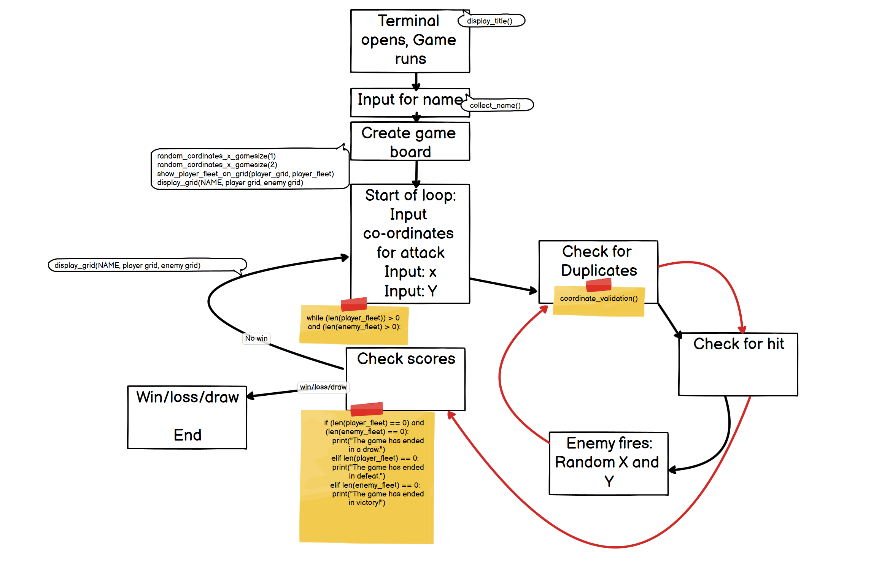

# Fullstack Battleships

This apication is a simple battleships game played on a 5x5 grid, i chose this project to try and best understand the core mechanics of pythin and to gain experience with game design.

[It is avilablke to play here](https://fullstack-battleships-4cdb574b78af.herokuapp.com/)

---

## CONTENTS

---

### Initial Description

Welcome to the Battleship Game This is an interactive version of the classic board game, designed to be played directly within a command line terminal. Dive in to challenge your skills against the computer.

- **Interactive Gameplay:** Input your cordinates and try to find the enemy ships, like the classic game. 
- **Dynamic Board:** New positions for yourelf and the enemy for every game.
- **Color display:** Using the dependency Colorama,the application can display colour into the command line.

## Design

### Description

They key part of the design is the gamplay loop that takes the players cordinates and the enemy's cordinates, checks them and then checks for a win/loose/draw situation.

In a tradional game of battleships, the player who has the first move has an advantage, the smaller the battle map the bigger that advantage, as I decided to do a small game of 5x5 having the program allow the enemy to return fire before checking for victory allowed for an even game, with an even number of shots on both sides, and the potential for a draw.

### Flowchart

## Features

### Future Implementations

- A way for the player to place the position of their own ships
- A way to change the gridsize of the game before it starts
- Logic to implement having ships of greater sized of 1x1
- A way to restrat your game mid game
- A auto restart once you finish your game.

## Technologies Used

- Colorama to apply colour to the terminal text
- Heroku for hosting the application on a site

### Languages Used

- Python

### Frameworks, Libraries & Programs Used

- [Colorama](https://pypi.org/project/colorama/)
- [Git](https://git-scm.com/)
- [Github](https://github.com/)
- [Gitpod](https://www.gitpod.io/)
- [Heroku](https://www.heroku.com/home)

## Deployment & Local Development

### Deployment

To deploy to the application hosting site [Heroku](https://www.heroku.com/home) the below steps were followed:

1. Choose an App name and set hosting region to Europe, then select "Create app".
2. Go to the Settings and add two Buildpacks in this order 
  - Python 
  - NodeJS
3. Go to the Settings to add a Config Vars: KEY = `PORT` and VALUE = `8000`
4. Select "Deploy" from the top menu.
5. Link the GitHub account by setting it as the deployment method, searching for the repository name, and selecting "Connect".
6. Click "Deploy Branch".

### Local Development

To clone this repository in your local IDE, enter the following into the terminal in your chosed IDE:

`git clone https://github.com/LaurieAnderson92/Battleships.git`

Please ensure python is installed on your computer.

#### How to Fork

1. Navigate to the github repositry found [here](https://github.com/LaurieAnderson92/Battleships)
2. Click on the **Fork** button.

Please ensure python is installed on your computer.

## Testing

Testing was carried out during the creation of the progam and after when I opened it up to my friends and coleages to review, details of the test and the bugs found have been detailed below

### Tests

- Took turns firing missiles at the opponent's ships. using injected print statements to ensure hits are detected correctly and that the game state updates accordingly.
- Tested the NAME input to ensure no rogue data could get into the system, the results can be seen [here](assets/documentation/battleships-name-testing.png)
- Tested the coordinate input to ensure no rogue data could get into the system, the results can be seen [here](assets/documentation/battleships-cord-testing.png)

### Bugs & Fixes

> - **Bug:** Name has no validation on the limit, which means a name of endless characters could be implemented.
> - **Fix:** commit bf61752
> - **Status:** Complete

> - **Bug:** Unclear that it's five 1x1 ships on the grid
> - **Fix:** commits 0ccc720 & 02ee683
> - **Status:** Complete

> - **Bug:** if multiple invalid inputs are placed, the battle grid goes out of view of the heroku terminal
> - **Proposed Fix:** a for loop for each input, to clear the screen and repost the grid after 4 failed attempts
> - **Status:** Pending

## Credits

### Code used
The clear function was given to me by my Code Institute mentor Rory and has been clearly marked as such within run.py
> `def clear():`\
>   `"""Clear function to clean-up the terminal so things don't get messy."""`\
>   `os.system("cls" if os.name == "nt" else "clear")`

### Acknolegements
- My best friend [Jordan Cook](https://github.com/Bowtie7114), for helping me with my Imposter syndrome and giving me the last push I needed.
- My mentor [Rory Patrick Sheridan](https://github.com/Ri-Dearg), for his continued and invaluable help and insight.
- W3Schools for Python Reminders and look ups for funtionality.
- [Phind](https://www.phind.com/search?home=true) for generating this README Template
